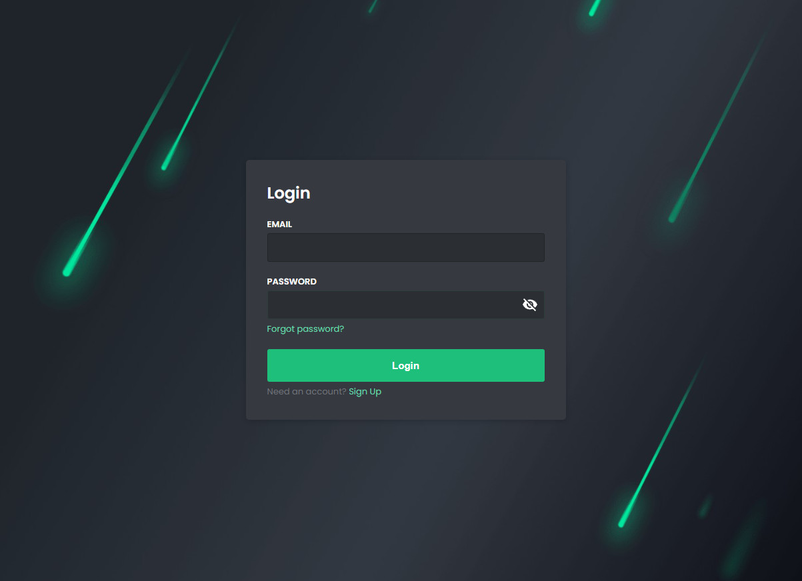
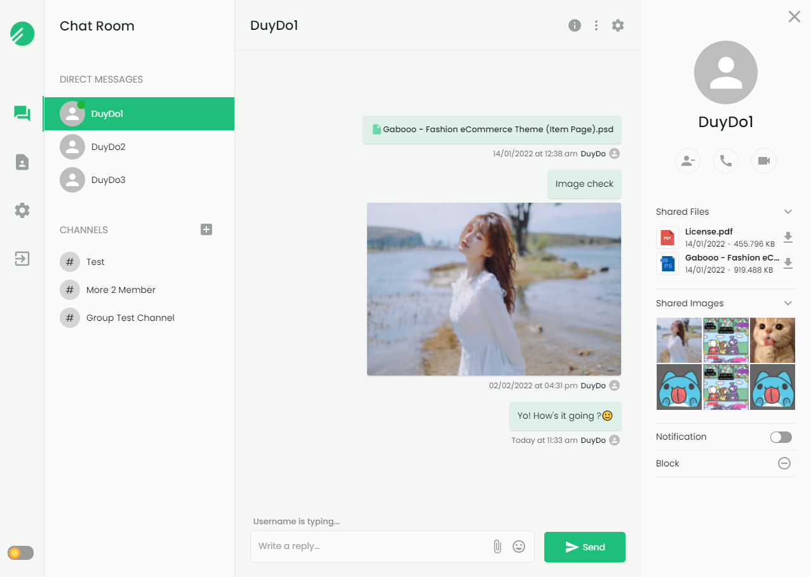
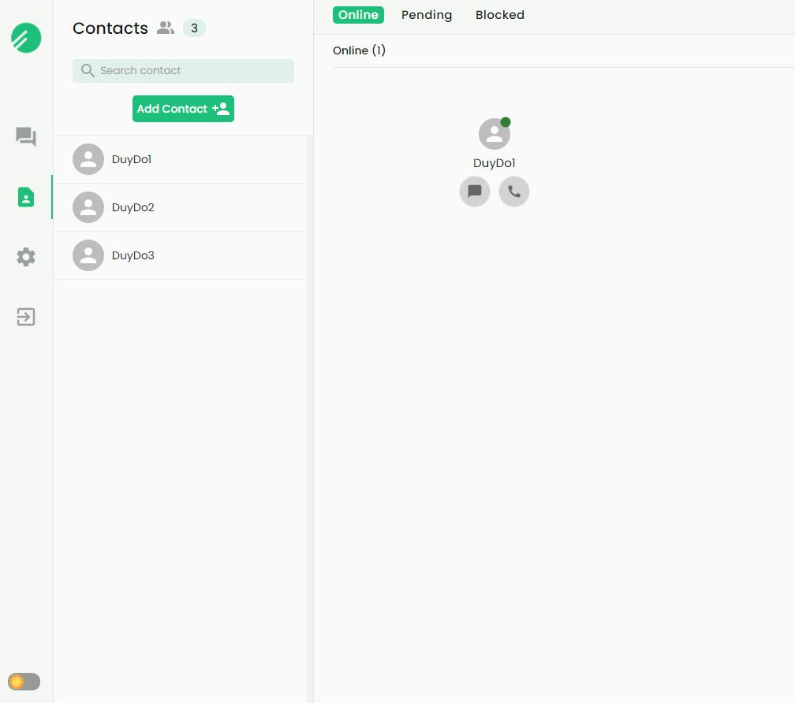

# Chat App WS

A chat application built with ReactJS and NodeJS

## Main technologies used in project

- Front-end: React Hooks, Redux Toolkit, Material UI (version 5), [WebSocket APIs](https://developer.mozilla.org/en-US/docs/Web/API/WebSocket)
- Back-end: ExpressJS, MongoDB, [ws](https://www.npmjs.com/package/ws), Mongoose
- Sub technologies: React Hook Form, SWR, Lottie, Emoji-mart, JWT, Cloudinary

## Features

- Authentication
- Create conversations (Direct, Group)
- Sending: Text, Image, File, Emoji
- View conversation, shared images and shared files
- Contact: Add contact, watch Pending and Blocked contacts, search
- Theme mode (Day, Night)
- Updating..........................

## Previews

  
  
  
